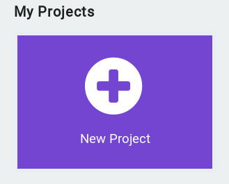
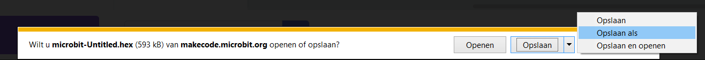
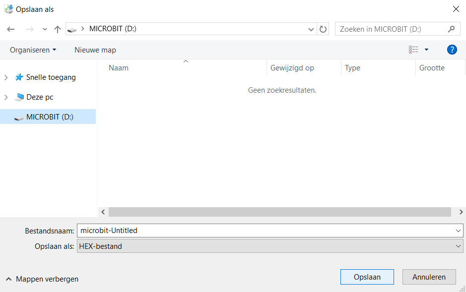

Ga met Internet Explorer naar [https://makecode.microbit.org](https://makecode.microbit.org) en kies 'New Project':

Bouw nu je programma in de simulator.

Tevreden? Download je programma naar de echte microbit via USB:

'Opslaan als':

Naar de MICROBIT-schijf:

